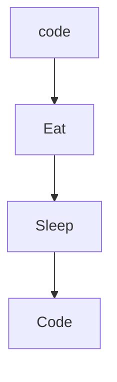

### Hi there 👋

<h1>Hello and welcome to my Github page.</h1>

<!--START_SECTION:activity-->

### My daily routine :

<!--END_SECTION:activity-->

<h2>English</h2>

Hello to those who visit my Github page! I am a young developer currently looking for a job.

Here is a short description of me :

- 🔭 I’m currently working on personal projects.
- 🌱 I’m currently learning technologies like Node JS and React.
- 👯 I’m currently looking for a job.
- 📫 How to reach me : beauchampx@outlook.com
- ⚡ Fun fact : I like animals, bodybuilding, literature and web development.

<h2>Français</h2>

Bonjour à ceux et celles qui visitent ma page Github! Je suis un jeune développeur actuellement à la recherche d'un emploi.

Ici se trouve une petite description de moi :

- 🔭 Je travaille actuellement sur des projets personnels.
- 🌱 J'apprends actuellement des technologies comme Node JS et React.
- 👯 Je suis actuellement à la recherche d'un emploi.
- 📫 Comment me joindre : beauchampx@outlook.com
- ⚡ Fun fact : J'aime les animaux, la musculation, la littérature et le développement web.

<h2>Languages and Tools :</h2>
<h3 style="text-decoration: underline;">Front-end :</h3>

<h3>Back-end :</h3>

<h3>CMS :</h3>

<h3>Others :</h3>

<h2>Connect with me :</h2>

